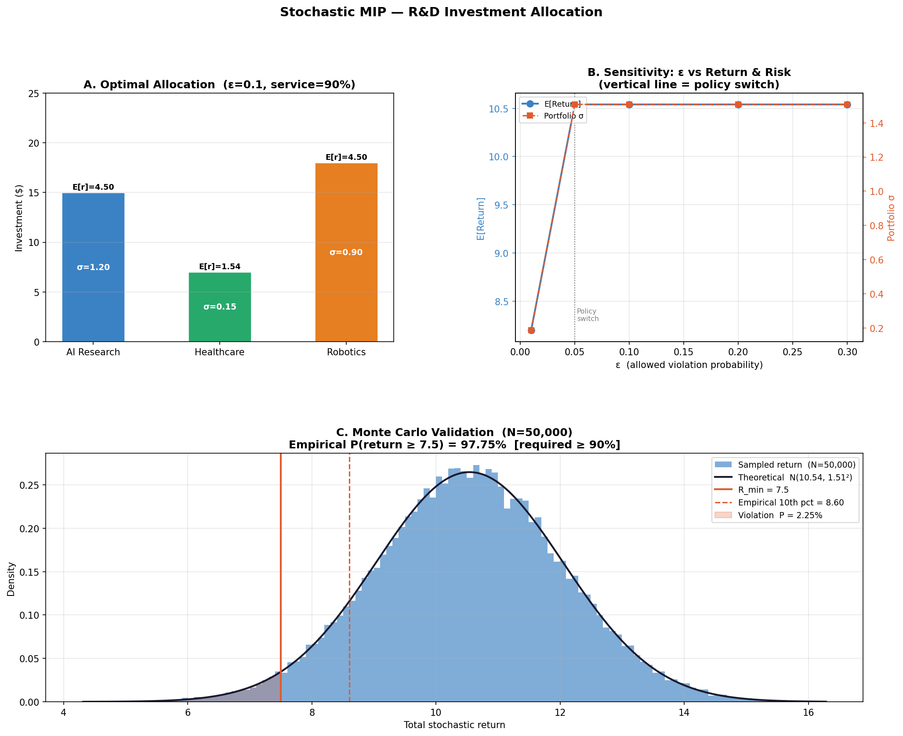

# Stochastic MIP for R&D Investment Allocation 

An Operations Research (OR) side project that solves a resource allocation problem under uncertainty using **Stochastic Mixed-Integer Programming (MIP)** and **Chance Constraints**. 

Instead of relying on rigid, deterministic forecasts, this model captures the inherent risks of R&D investments and provides optimal investment strategies mapped to an organization's risk tolerance ($\epsilon$).

---

## 💡 Key Features
- **Deterministic Equivalent Transformation:** Converted a probabilistic chance constraint into a deterministic linear form using the inverse CDF of normal distribution ($\Phi^{-1}$).
- **Policy Switch Discovery:** Conducted sensitivity analysis across different risk levels ($\epsilon$), successfully capturing the tactical shift from low-risk portfolios (Healthcare/Manufacturing) to high-return/high-risk ones (AI/Robotics).
- **Monte Carlo Validation:** Simulated $50,000$ market scenarios to empirically validate that the solver's allocation strictly meets the required service level ($P(\text{return} \ge R_{min}) \ge 1-\epsilon$).
- **Custom Optimization :** "For small-scale instances ($J≤15$), we apply complete enumeration over all ($2^J−1$)project subsets. This approach guarantees global optimality but does not scale to large instances, where decomposition methods such as Benders Decomposition would be required."

---

## 📊 Methodology & Mathematical Formulation

The problem is modeled as a Mixed-Integer Non-Linear Program (MINLP), which is then linearized via variable fixing for exact inference.

### 1. Objective Function
Maximize the expected total portfolio return:
$$\max \sum_{j \in J} \alpha_j \cdot z_j$$

### 2. Constraints
- **Budget Constraint:** Total investment cannot exceed budget $B$.
- **Activation Logic:** Investment $x_j$ is bounded by minimum cost $c_j$ and maximum capacity $cap_j$ only if project $j$ is selected ($y_j = 1$).
- **Chance Constraint (Risk Control):** Ensures the probability of achieving the minimum required return ($R_{min}$) is at least $1-\epsilon$:
  $$P\left( \sum_{j \in J} \tilde{r}_j \ge R_{min} \right) \ge 1 - \epsilon$$

Using the normal distribution assumption, this is transformed into its **Deterministic Equivalent**:
$$E[\text{Return}] - \Phi^{-1}(1-\epsilon) \cdot \sqrt{\sum_{j \in J} \sigma_j^2 y_j} \ge R_{min}$$

---

## 📈 Visualizations & Results

### Key Insights from the Analysis:
1. **Panel A (Optimal Allocation):** At $\epsilon = 0.10$ (90% Confidence), the model wisely balances the high-yield AI/Robotics sectors with a safe-haven asset (Healthcare, $\sigma=0.15$) to buffer volatility.
2. **Panel B (The Policy Map):** A clear policy switch is observed near $\epsilon = 0.05$. When risk tolerance is extremely tight ($\epsilon \le 0.05$), high-risk projects are completely dropped. 
3. **Panel C (Empirical Proof):** The Monte Carlo simulation confirms an empirical success rate of **97.75%**, safely outperforming our 90% theoretical requirement.

---

## 🛠️ Tech Stack & Requirements
- **Language:** Python 3.x
- **Optimization:** PuLP (CBC Solver)
- **Scientific Computing:** NumPy, SciPy (for Statistics)
- **Data Visualization:** Matplotlib (GridSpec layout)
